# Lacquer

**Automatic restoration and mastering for finished music mixes.** Give it a stereo track and it rebuilds clipped
peaks, removes echo and excess reverb, checks the instrument balance, evens out level problems, and masters the
result against the measured norms of released music or against a reference track. It tells you every decision
it made, with the reading behind it, and leaves alone whatever is already fine.


*One real run on a held-out clip that was damaged with room reverb and a 163 ms echo. Left of the white line is
the restored audio, right of it the damaged input. The echo is found and inverted by DSP, the reverb is
removed by the network, the vocal reverb and the dynamics are measured and judged normal, and loudness is set for release.*

A lacquer is the disc a record's master is cut into. [`docs/design.md`](docs/design.md) explains the design,
including why the network corrects a spectrogram instead of generating audio from codec tokens.

## Headline

Held-out music with synthetic damage. SI-SDR is closeness to the clean track in dB (higher is better).

| test | damaged | after Lacquer |
|---|---:|---:|
| Echo, 79 clips (DSP stage alone, no training) | 8.8 dB | **25.2 dB** |
| Hard clipping, 29 clips (DSP stage alone, no training) | 20.1 dB | **26.7 dB** |
| Room reverb on the whole mix, 24 MUSDB18-HQ test songs | 4.7 dB | **9.7 dB** |
| Reverb on the vocal only, same songs | 6.7 dB | **7.8 dB** |
| Reverb from a plug-in style the model never trained on, 40 clips | 3.6 dB | **8.7 dB** |
| Reverb from six real rooms the model never trained on, 40 clips | 3.1 dB | **5.7 dB** |
| Level problems inside a track, 20 clips (envelope error, lower is better) | 4.5 dB | **2.4 dB** |
| Tonal fault with a reference track, 200 tracks (tone error, lower is better) | 3.1 dB | **0.19 dB** |

A separate judge that never sees the clean reference (Meta's Audiobox Aesthetics, production quality 1-10)
rates reverberant clips 6.37, the restored versions 6.63, and the clean originals 6.66.

Against other tools on the same reverberant clips: classical WPE and four released community dereverb models
land between -0.5 and 3.9 dB where Lacquer reaches 9.1 dB (input 3.2 dB). On the unseen real rooms none of them
improves the average; Lacquer gained 1.7 dB there, and 2.6 dB after 6,500 training steps with simulated rooms
added (E18, E20, E22, E27).

What does not work yet, stated plainly: real rooms outside the training set gain far less than rooms inside it;
noise and soft saturation are not improved; blind EQ correction and undoing compression or limiting are unsolved
(measured, see below); the careful thresholds that protect clean music also leave light reverb, tempo-synced
echoes and moderately wet vocals alone; everything above is synthetic damage on real music.

Every number has its experiment, data and caveats in [`docs/experiments.md`](docs/experiments.md).

## Paper

A paper on this work is in preparation for **DAFx27**, the 30th International Conference on Digital Audio
Effects (Cremona, Italy, 24 to 27 August 2027). DAFx is the venue whose scope matches best: its call lists audio
restoration and machine learning for audio, and the work is a hybrid of DSP and learned models. The DAFx27 call
is not published yet. The 2026 edition allowed 8 pages, used double-blind review and discouraged preprints, so
the draft is kept out of this repository.

What the paper still needs before submission:

- A listening test. The tooling is here (`remaster/listening.py`, `remaster/build_listening_trials.py`): a blind
  MUSHRA-style page with a hidden reference, loudness-matched stimuli, and an analysis with the BS.1534 listener
  screening and Holm-corrected Wilcoxon tests. It needs 15 or more listeners.
- A comparison against SonicMaster, the closest published system. Its inference depends on a gated model that
  needs a license acceptance, so it has not been run here yet.
- Recordings damaged in the field. All damage evaluated so far is synthetic, applied to real music.

## Contents

- [Paper](#paper)
- [How it works](#how-it-works)
- [Mastering](#mastering)
- [Inside the model](#inside-the-model)
- [The decisions](#the-decisions)
- [What the experiments found](#what-the-experiments-found)
- [Try it](#try-it)
- [Train and evaluate](#train-and-evaluate)
- [Layout](#layout)
- [Credits and licenses](#credits-and-licenses)

## How it works

Each problem goes to the tool that suits it. Problems with an exact answer use DSP. Problems that need a
learned prior use a network. Aesthetic choices are measured against a normal range and left alone inside it.

| stage | method | module |
|---|---|---|
| Hard clipping | Flat-ceiling detection, then the clipped samples are rebuilt by consistent sparse reconstruction (A-SPADE) | `remaster/declip.py` |
| Discrete echo | Cepstral detection, a tempo-grid check that spares musical delays, then an exact recursive inverse filter | `remaster/deecho.py` |
| Room reverb, noise, clipping | Band-split transformer that predicts a complex mask on the stereo spectrogram, fine-tuned from a pretrained vocal dereverb model | `remaster/pretrained.py`, `remaster/train.py` |
| Reverb decisions | The same network is a calibrated meter for excess reverb on the mix; a vocal model measures how wet the vocal stem is | `remaster/reverb_meter.py`, `remaster/stems.py` |
| Instrument balance | Stem loudness relative to the mix against its range in professional mixes; readings outside it are reported, and a vocal can be moved to the edge on request, applied as a stem difference | `remaster/stem_master.py` |
| Level riding | A small controller network outputs a gain trajectory (a VU-ballistics rider is the fallback) | `remaster/controller.py`, `remaster/vu.py` |
| Tone, stereo image, band dynamics | 60 measured features compared with the 10th to 90th percentile range of released music in the chosen genre, or with a reference track | `remaster/analysis.py`, `remaster/mastering.py` |
| Loudness and peaks | BS.1770 target by delivery profile, two-stage true-peak limiter with a 3 dB limiting budget | `remaster/master.py`, `remaster/mastering.py` |

The restoration network never generates audio. It multiplies the input spectrogram by a mask that starts as
all ones, so anything it does not touch passes through unchanged. There is no codec or vocoder in the path.

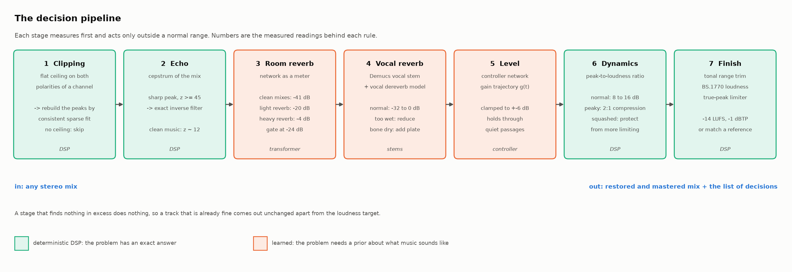

## Mastering

Mastering here means what a mastering engineer does to a mix that is already good: measure it, compare it with
released music of its kind, and change as little as the readings call for. The rules and their sources are in
[`docs/research/mastering_practice.md`](docs/research/mastering_practice.md) (73 references: standards,
platform specs, measured studies), and the prior work in
[`docs/research/automastering_literature.md`](docs/research/automastering_literature.md).

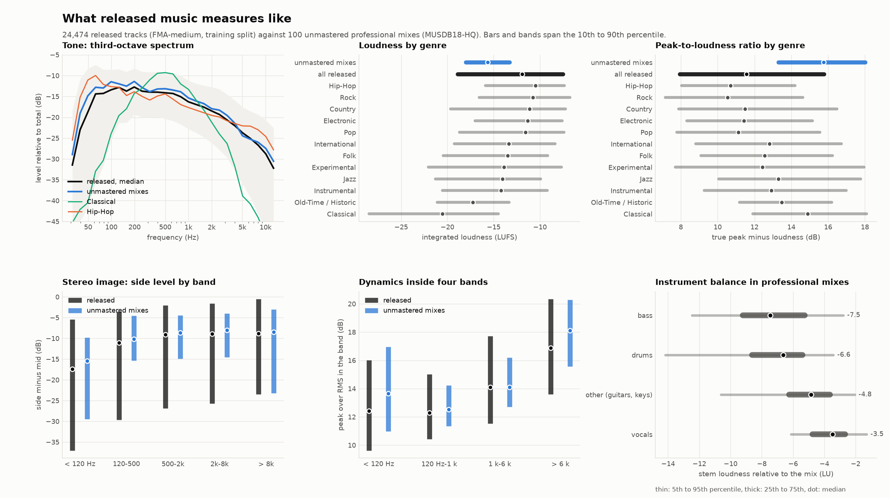

**What released music measures like (E24).** 103,838 released tracks (FMA-large, 14 genres) and 150 unmastered
professional mixes, 60 features each. Unmastered professional mixes have the same tone and stereo image as
released music (spectral slope -5.1 against -5.3 dB/octave) and 4 dB more peak-to-loudness ratio. Mastering a good mix
is mostly a dynamics and loudness job. Vocals sit 3.5 LU under the mix in the professional mixes, close to the
published -2.7 LU.

**What cannot be corrected blind (E25, E26).** A track's own tone is 5.2 dB away from the average of all music,
4.6 dB from the average of its genre and 4.3 dB from its nearest neighbours, while a typical tonal mistake is
2.3 dB. Population norms therefore take back only a few percent of a tonal fault, and no estimator we tried does
better. A reference-free quality predictor is also blind to these faults (it prefers the original over the
faulted version 47 to 60% of the time). So blind tone moves are capped at 1.5 dB, the size engineers call normal,
and anything larger is reported as a mix problem. A reference track lifts the cap.

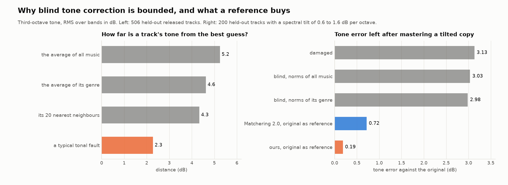

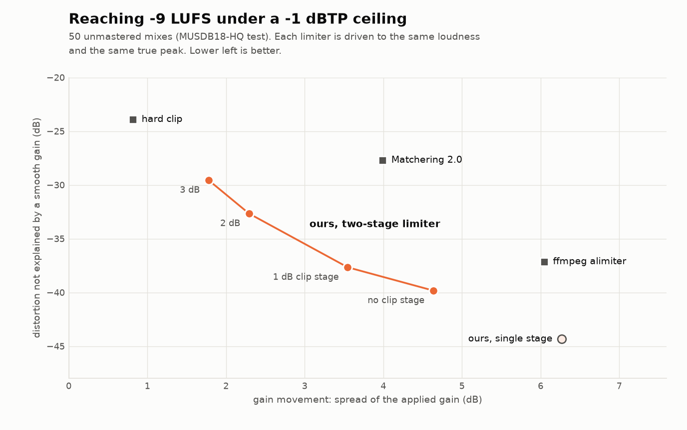

**Loudness without damage (E28, E29).** 50 unmastered mixes are driven to -9 LUFS under a -1 dBTP ceiling by each
limiter. At equal loudness and equal true peak the two-stage limiter leaves 5 to 10 dB less distortion than
Matchering's with less gain movement, and matches ffmpeg's limiter on distortion with 2.5 dB less gain movement.
Left to their defaults, every baseline overshoots the true-peak ceiling by 0.9 to 1.9 dB. Against the iZotope
Ozone 9 Maximizer versions of the same songs (musdb-XL), at Ozone's loudness and peak, it leaves 5 to 8 dB less
distortion at equal or lower gain movement, while Ozone changes the long-term spectrum least. These are signal
measures. Which limiter sounds better is a listening-test question.

**Reference mastering (E25).** Give it a reference track and the same chain matches the mid and side spectra,
band dynamics and loudness of the reference. On 200 held-out tracks with a deliberate tonal fault and the
original as reference, it leaves 0.19 dB of tone error after a tilt and 0.12 dB after EQ bumps, where
Matchering 2.0 leaves 0.72 and 0.65 dB (ours closer on 80 to 88% of tracks). Matchering is more exact on stereo
width (0.03 against 0.27 dB) and on peak-to-loudness ratio.

**Instrument balance from the finished mix (E30, E31).** A level error on one stem can be partly undone from
the mix alone: when the stage acts, the balance error falls from 6.9 to 4.6 dB, and separated stems cost almost
nothing against true stems because the change is applied as a stem difference. The limit is the decision, since
balance varies widely in professional mixes. Checking all four stems would alter a third of unmodified songs, so
only the vocal is a candidate (8% of unmodified pop and rock songs touched, 44% of vocal faults caught). On
released music of all genres even that fires on a fifth of tracks, mostly on samples and separation residue, so
the vocal reading is reported by default and moved only on request (E33). Correcting the tone of individual
stems made every case worse and is off.

**Decisions with a budget.** The limiter may take 3 dB (6 dB for the loud profile). A target that needs more is
not reached and the report says by how much. The ceiling drops to -2 dBTP above -14 LUFS. Delivery profiles:
streaming (-14 LUFS), track normalization (-16), loud (-9), broadcast (-23), film streaming (-27).

## Inside the model

Everything in this section is drawn from one real forward pass: a 4 s clip damaged with room reverb and a
single 210 ms echo, run through the network with hooks on every stage (`python -m remaster.trace`, then
`python -m remaster.figures_deep`). The spectrograms, the values on the faces of the tensor blocks, the
attention maps and the mask are that run's data.

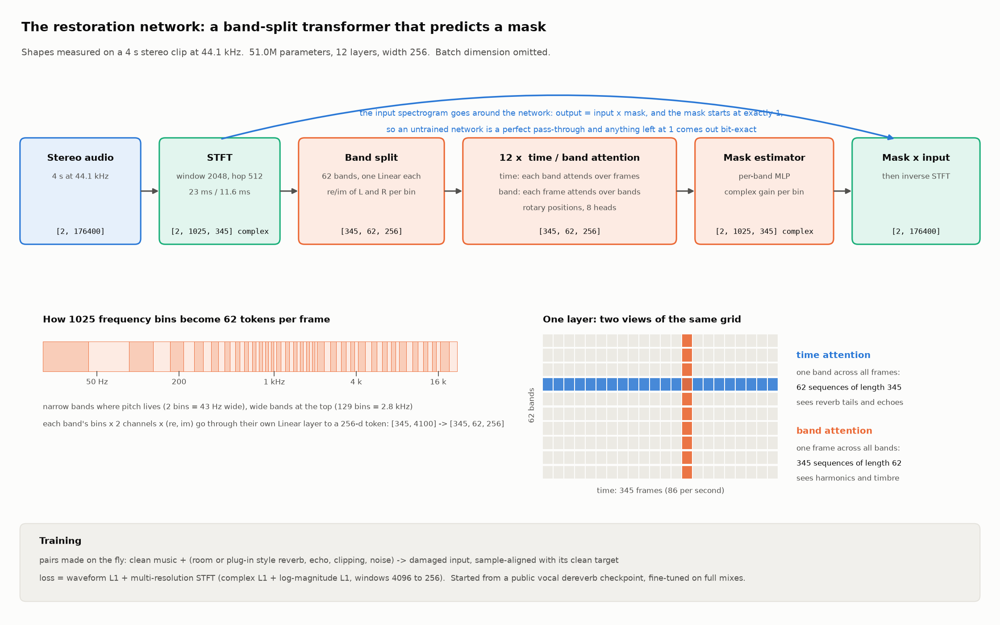

### Stage 1. Sound becomes a grid

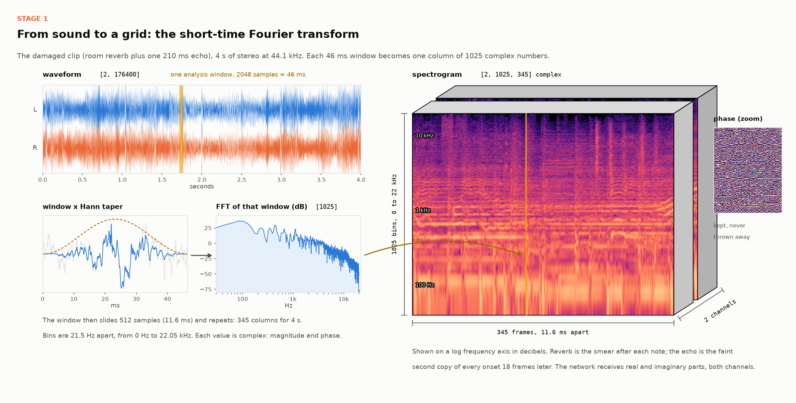

The clip is `[2, 176400]`: two channels, 4 s at 44.1 kHz. A 2048-sample window (46 ms) is tapered, transformed,
and slid forward 512 samples (11.6 ms), 345 times. The result is `[2, 1025, 345]` complex numbers: 1025
frequency bins 21.5 Hz apart, 345 frames, both channels, magnitude and phase kept.

### Stage 2. 1025 bins become 62 tokens

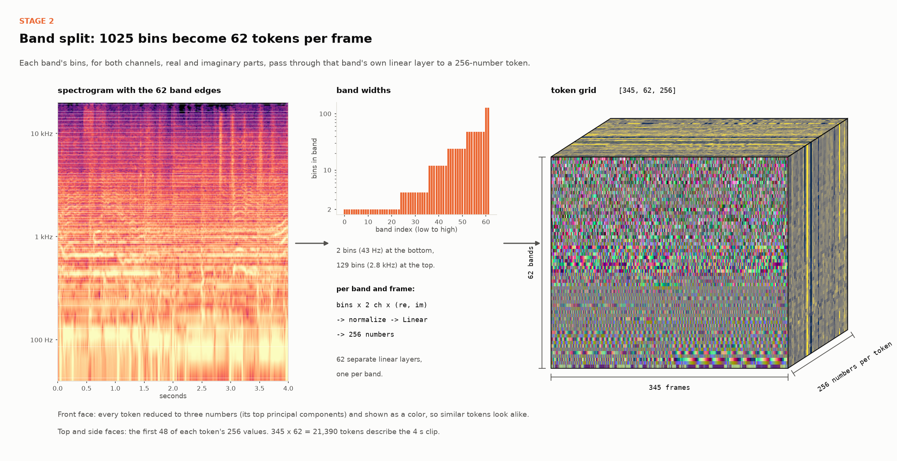

Frequency is cut into 62 bands, 2 bins wide at the bottom (43 Hz, where pitch needs resolution) and up to 129
bins wide at the top (2.8 kHz). For each band and frame, the bins of both channels (real and imaginary parts)
go through that band's own linear layer and come out as 256 numbers. The clip is now `[345, 62, 256]`:
21,390 tokens.

### Stage 3. Twelve layers

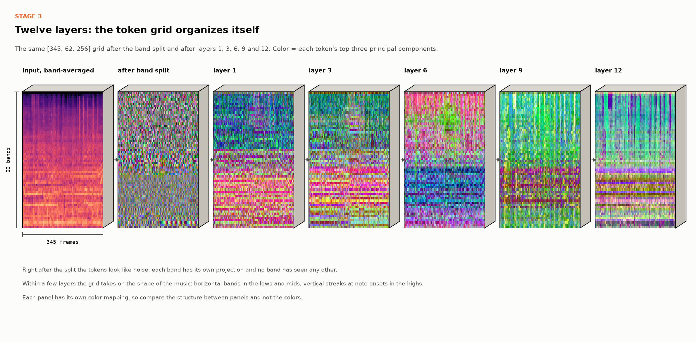

Each layer has two halves. Time attention treats every band as a sequence of 345 frames. Band attention
treats every frame as a sequence of 62 bands. The grid starts as noise and takes on the shape of the music.

### Stage 4. What attention looks at

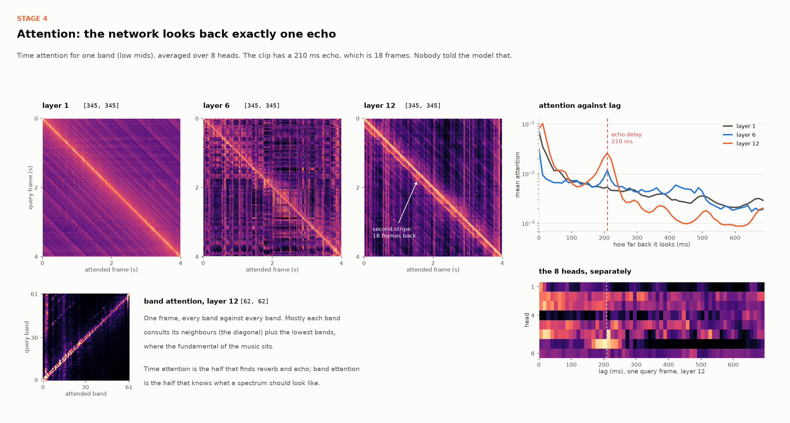

This is the most direct evidence of what the network learned. The clip's echo is 210 ms late, which is 18
frames. In layer 12 the time attention has a second stripe 18 frames below the diagonal, and its average
weight against lag peaks at exactly 210 ms. One of the eight heads carries most of it. The delay was never
given to the model; it finds the earlier copy of each sound and uses it.

This holds beyond one clip. Over 30 held-out clips with random echo delays from 90 to 500 ms, layer 6 puts its
largest relative increase in attention within one frame of the true delay in 30 of 30 clips, and layer 12 puts a
median 14 times more weight on the true lag than on the same clip without the echo. Layer 1 does not react.

### Stage 5. The mask

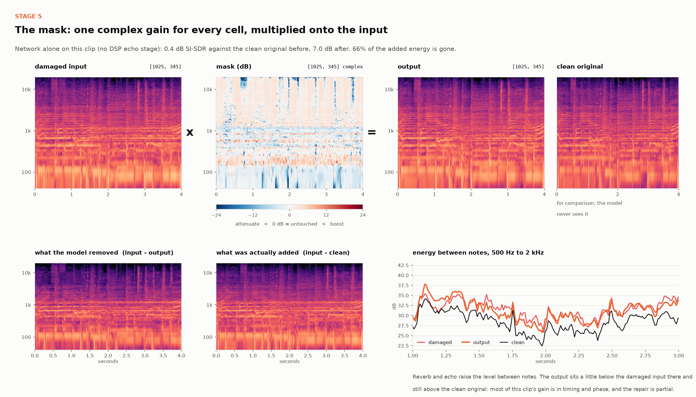

A small network per band turns each token into a complex gain for every bin it covers, `[2, 1025, 345]` again.
The gain multiplies the input spectrogram and an inverse STFT returns audio. On this clip, with the network
alone, SI-SDR against the clean original goes from 0.4 to 7.0 dB. The repair is partial: the level between
notes drops a little and stays above the clean original.

The model has 51 M parameters. It was fine-tuned from a public vocal dereverb checkpoint with a waveform L1
loss plus a multi-resolution STFT loss (complex L1 and log-magnitude L1 at windows from 4096 down to 256).

### Stage 6. Echo, by DSP

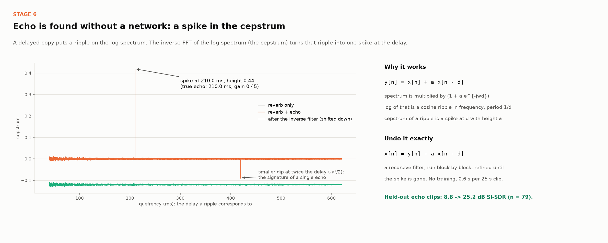

In the full pipeline the echo never reaches the network. A delayed copy shows up as one spike in the cepstrum,
at the delay, with height equal to its gain. Here it reads 210.0 ms and 0.44 for a true 210.0 ms and 0.45, and
the inverse filter removes it.

### Stage 7. The level controller

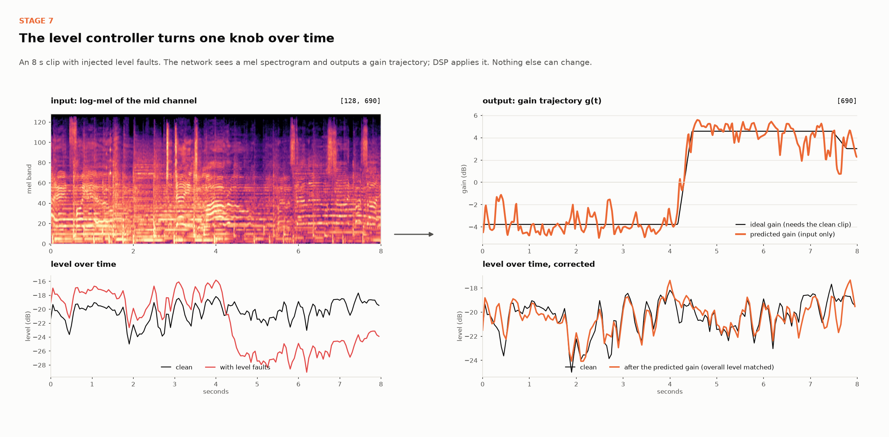

The second network is small (5.7 M parameters) and outputs parameters instead of audio: a gain value for each
of the 690 frames in an 8 s clip (and a 32-point EQ curve that stayed near zero in training). On this clip it
recovers an 8 dB level step it was never told about. With ideal parameters this family of corrections repairs
almost all tone and dynamics damage; blind, the network learned the fader and not the EQ.

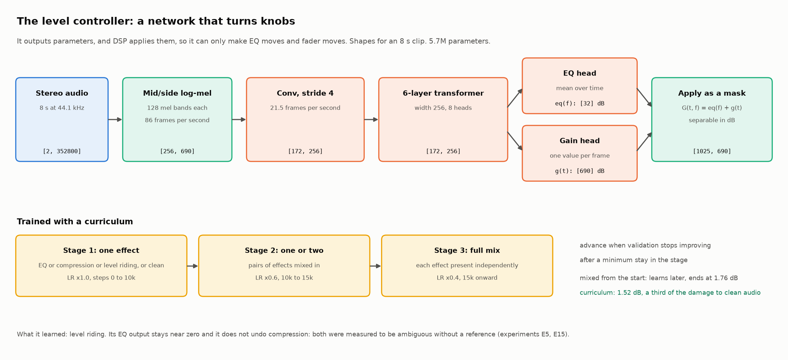

### Why a mask and not codec tokens

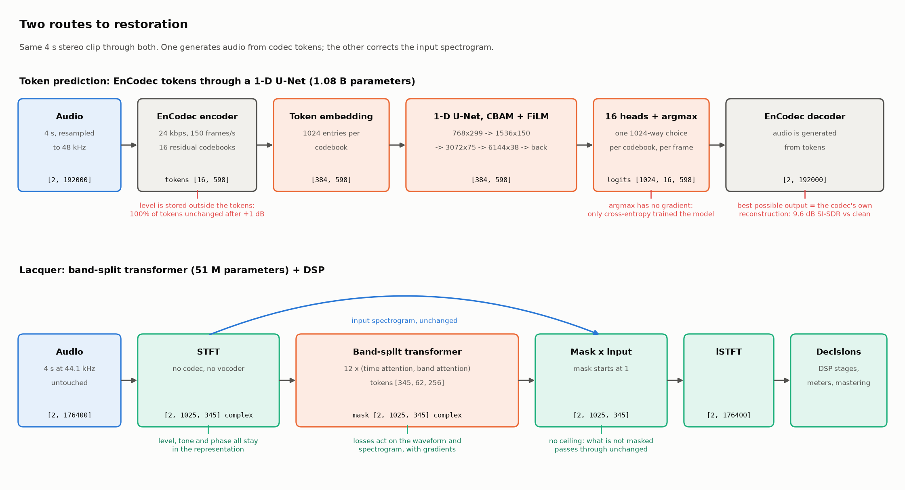

An obvious alternative is to encode the track with a neural codec, predict clean tokens with a large network
and decode. I built and measured that route first (EnCodec tokens, a 1.08 B parameter 1-D U-Net). It could not
beat its own input, for three reasons that are properties of the route and not of the network: level is not
in the tokens, audio losses sit behind an `argmax`, and the decoder caps quality at the codec's own
reconstruction. Measurements are in [`docs/design.md`](docs/design.md).

### Training evidence

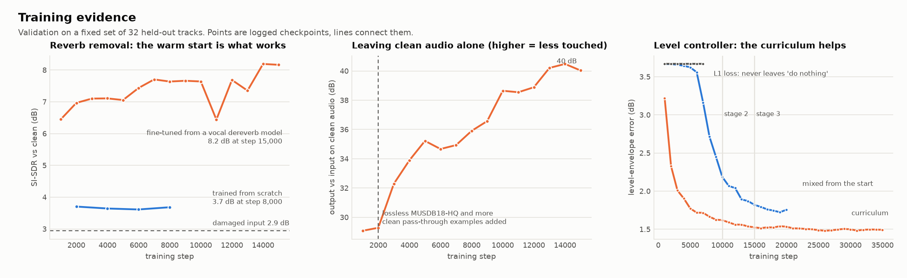

### What EnCodec is good for

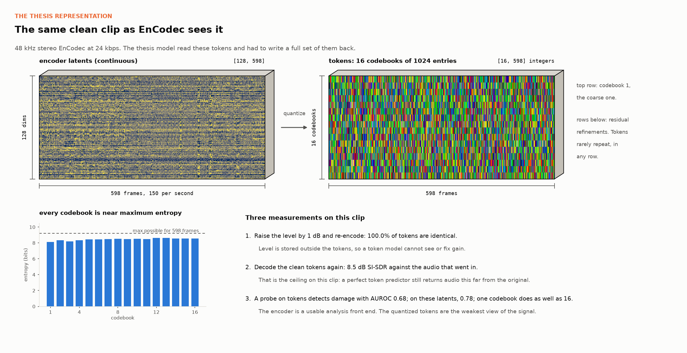

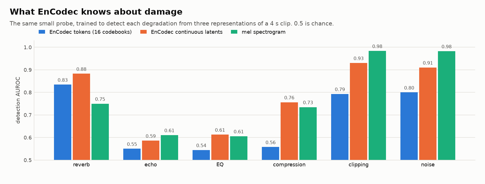

Quantizing to tokens discards most of what distinguishes damaged audio from clean. The encoder's continuous
latents keep it, about as well as a plain mel spectrogram, and better for reverb.

## The decisions

`remaster/infer.py:enhance_auto` runs the chain and returns a report like the one in the animation:

1. **Clipping.** A channel whose samples pile up at a flat ceiling on both polarities was hard-clipped. The
   samples under the ceiling are exact and the clipped ones are known to be at least that large, so the peaks
   are rebuilt as the sparsest spectrum consistent with both facts. No ceiling, no action.
2. **Echo.** A delayed copy leaves a ripple on the log spectrum, which is a sharp peak in the cepstrum. If one
   is found, the delay and echo path are read off and inverted. If the delay sits on the tempo grid (a whole
   number of sixteenth notes or triplet eighths) it is a delay effect or a loop, and it is reported and left alone.
3. **Room reverb.** The network's proposed change is measured first, on a few windows. On clean productions it
   reads about -42 dB (95% of released tracks are under -20 dB); with heavy added reverb about -4 dB. Above the
   gate of -18 dB the reverb is removed, scaled by how far above; below it the network is bypassed.
4. **Vocal reverb.** The vocal stem (Demucs) gets an absolute wetness reading. Produced vocals span a wide
   range, so the vocal is only changed when it is clearly outside it: reduced to the edge of the range if far
   too wet. A bone-dry vocal is reported, and gets a plate only on request. Stems are remixed only when the
   vocal was changed.
5. **Instrument balance.** The loudness of each separated stem relative to the mix is compared with its range in
   professional mixes, measured on separated stems. Readings outside the range are reported. On request a vocal
   outside its range is moved to the edge, applied as a difference so that untouched stems contribute nothing
   and their separation artifacts never reach the output.
6. **Level.** A gain trajectory is predicted for the whole track and applied as a fader move when it exceeds
   3 dB. A steady track is left alone.
7. **Tone and stereo image.** Third-octave bands and band-wise side level outside the range of the chosen genre
   are moved to its edge, by at most 1.5 dB unless a reference track is given. A decorrelated low end is narrowed.
8. **Dynamics.** Band crest factors and the peak-to-loudness ratio are compared with the genre's range. Peaky
   bands or mixes get 2:1 compression on the excess; mixes that are already dense are flagged and protected.
9. **Loudness and peaks.** Gain to the delivery target, then the two-stage true-peak limiter inside its budget.

A "reverb target" control shifts steps 3 and 4 drier or wetter.

## What the experiments found

Short versions. Each links to numbers in [`docs/experiments.md`](docs/experiments.md).

- **Predicting codec tokens could not win.** Gain is invisible in EnCodec tokens, and a perfect prediction
  decodes to 9.6 dB SI-SDR against the clean track, below the damaged input it was meant to fix
  ([`docs/design.md`](docs/design.md)).
- **A warm start mattered more than architecture.** From scratch, 8,000 steps bought +0.8 dB on reverb. Fine-tuning
  a public vocal dereverb model on full mixes bought +3.5 dB in 1,000 steps, although that model wrecks full mixes
  when used as released (E2, E3).
- **Echo is a DSP problem.** Cepstral detection plus an exact inverse beats the network by 15 dB with no training (E4).
- **Clipping is a DSP problem too.** The network never improved clipped audio in SI-SDR. A declipper that uses
  what clipping leaves intact gains 6.6 dB and improved 29 of 29 clips, with no false triggers on 150 full songs (E21).
- **Released dereverb tools do not transfer to finished mixes.** WPE and four community models, built for speech
  or vocal stems, change the average by -3.7 to +0.7 dB on reverberant mixes where the fine-tuned network gains 5.9 dB (E18, E20).
- **Unseen real rooms are the weak point.** On six rooms outside the training set the gain drops from 5.9 dB to
  1.7 dB. The network learned its 270 training rooms much better than room reverb in general (E22). Adding 4,000
  simulated rooms to training raised it to 2.6 dB within 6,500 steps, and that run continues (E27).
- **The music survives.** Restored clips keep their notes and get their rhythm back: onset-envelope correlation
  with the clean track goes from 0.85 to 0.96 under reverb plus echo, and note decay time returns to the clean value (E19).
- **A good mix needs dynamics work more than tone work.** Unmastered professional mixes match released music in
  tone and stereo image and differ by 4 dB of peak-to-loudness ratio (E24).
- **Blind tone correction has an information bound.** Natural variation between tracks (5.2 dB) is twice a
  typical fault (2.3 dB), so norms recover 1 to 3% of a fault where a reference recovers 94% (E25).
- **With a reference, matching mid and side spectra beats Matchering on tone.** 0.19 against 0.72 dB after a
  tilt, on 200 tracks; Matchering stays ahead on stereo width (E25).
- **The limiter is where an open tool can beat the baselines.** Equal loudness, equal true peak: less distortion
  and less gain movement than Matchering, and in the same class as Ozone 9 on signal measures (E28, E29).
- **CBAM helps a little, FiLM without a condition does nothing.** On a U-Net baseline CBAM raises the identity
  score from 25 to 30 dB; neither closes the gap to a pretrained start (E23).
- **Clean music is the hardest test.** Run on 98 untouched released tracks, the first version of the repair half
  changed every one of them: tempo-synced delays were removed as echoes, quiet vocal samples were boosted, and the
  level controller nudged everything. After recalibrating on that audit, 80 of 98 come out bit-identical and the
  rest are listed proposals (E33).
- **Stems are for balance, and only the vocal.** Stem tone correction made mixes worse; stem level correction
  works mechanically, but only the vocal has a range tight enough to act on without touching a third of clean
  songs (E30, E31).
- **Room reverb belongs to the whole mix, vocal reverb to the stem.** Neither approach wins both cases, so the
  pipeline decides at two levels (E8).
- **EnCodec tokens are a poor place to look for damage.** The same probe detects degradations with AUROC 0.68
  from tokens, 0.78 from the encoder's continuous latents, and 0.78 from a mel spectrogram. One codebook does as
  well as sixteen (E10).
- **A curriculum earns its place.** Training the controller on all effects at once left it stuck at
  "do nothing". A single-effect, then pairs, then full-mix schedule got it moving and ended
  ahead: level-envelope error 1.52 dB against 1.76 dB, with a third of the disturbance to clean input (E14).
- **Some things are not learnable blind at this scale.** Track-to-track tonal variation (3.6 dB) is larger than
  a typical EQ mistake (2.6 dB), so pulling toward an average spectrum hurts more than it helps (E5). Undoing
  compression and limiting did not train, and a published de-limiter only partly transfers to a different
  limiter (E15).

## Try it

Replay the recorded session in a terminal. No GPU, no checkpoints, only NumPy:

```bash
python -m remaster.demo replay
```

Run the web app (A/B player with loudness matching, spectrograms, VU traces, the decision list, and a stress
test that damages your upload first so you can hear the repair):

```bash
python -m venv .venv && source .venv/bin/activate
pip install -r requirements.txt
python -m remaster.app          # http://127.0.0.1:7860
```

The app looks in `remaster/checkpoints/` for `best.pt` (restoration), `vocal_dereverb.pt` (vocal meter) and
`controller.pt` (level riding). Checkpoints are not in the repository. Without them it runs the DSP stages only.
Pick a style (the genre whose norms apply), a delivery profile, and optionally a reference track.

Master one file from Python:

```python
from remaster.data import load_audio
from remaster.mastering import master_track
y, report = master_track(load_audio("mix.wav"), genre="Rock", profile="streaming")
print("\n".join(report["decisions"]))
```

Run a blind listening test (MUSHRA-style, with a hidden reference where one exists). Put each trial in a folder
with `reference.wav` and one WAV per system, then:

```bash
python -m remaster.listening build --src trials/ --dir listening/
python -m remaster.listening serve --dir listening/        # http://127.0.0.1:7871
python -m remaster.listening analyze --dir listening/ --target lacquer
```

## Train and evaluate

```bash
# restoration network: fine-tune a released BS-RoFormer on full-mix degradations
python -m remaster.train --data <music dirs> --rir <impulse responses> --out runs/x --task artifact \
    --arch msst_bs --msst-config remaster/pretrained_cfg/anvuew_bs.yaml --init <released checkpoint>

# level controller with the curriculum schedule
python -m remaster.controller --curriculum --data <music dirs> --rir <IRs> --out runs/ctrl

python -m remaster.evaluate_pipeline --ckpt runs/x/best.pt --data <music> --rir <IRs> --out eval/pipeline
python -m remaster.evaluate_stems --musdb <musdb18hq/test> --rir <IRs> --mix-ckpt ... --vocal-ckpt ... --out eval/stems
python -m remaster.evaluate_quality --ckpt runs/x/best.pt --data <music> --rir <IRs> --out eval/quality

# mastering: corpus norms, recovery test, limiter comparison, reference mastering against Matchering and ITO-Master
python -m remaster.build_mastering_norms --fma <fma_medium> --metadata <tracks.csv> --musdb <musdb18hq> --out data/norms
python -m remaster.mastering_norms --corpus data/norms/corpus.npz --stems data/norms/stems.npz
python -m remaster.evaluate_mastering --fma <fma_medium> --corpus data/norms/corpus.npz --out eval/mastering
python -m remaster.evaluate_loudness --musdb <musdb18hq/test> --out eval/loudness --true-peak-safe
python -m remaster.evaluate_reference_baselines --fma <fma_medium> --corpus data/norms/corpus.npz --out eval/reference
python -m remaster.stats                                   # paired statistics with confidence intervals
```

`scripts/` holds helpers for training on a remote GPU box over a shared SSH socket.

## Layout

```
remaster/                    package: models, DSP stages, training, evaluation, web app, demo
remaster/third_party/msst/   BS-RoFormer and Mel-Band RoFormer model code, vendored (MIT)
docs/design.md               design rationale: why masking, why not codec tokens
docs/experiments.md          every experiment with numbers, including the negative results
docs/research/               mastering practice with sources, and the automatic mastering literature
docs/evidence/               figures and metric files behind those numbers
docs/demo/                   the recorded session and animation shown above
docs/figures/                diagrams and charts in this README (remaster.figures, remaster.trace + remaster.figures_deep)
scripts/                     remote training helpers
```

The Python package keeps its working name, `remaster`.

## Credits and licenses

- Model code in `remaster/third_party/msst` is from
  [Music-Source-Separation-Training](https://github.com/ZFTurbo/Music-Source-Separation-Training) (MIT).
- The restoration network is fine-tuned from anvuew's `dereverb_bs_roformer` checkpoint (GPL-3.0). Weights
  derived from it carry that license.
- Stem separation uses [Demucs](https://github.com/facebookresearch/demucs) (MIT). Quality scoring uses
  Meta's Audiobox Aesthetics.
- Training data: FMA (per-track Creative Commons licenses), MUSDB18-HQ (educational use), MIT IR Survey,
  simulated rooms from pyroomacoustics. Several of these exclude commercial use.
- Evaluation only: Aachen Impulse Response database (unseen rooms), musdb-XL (Ozone-limited MUSDB18-HQ, CC BY 4.0).
- Baselines run for comparison and not shipped: Matchering 2.0 (GPL-3.0), ITO-Master (CC BY-NC 4.0), WPE
  (`nara_wpe`), UVR and MDX community dereverb models, ffmpeg, Pedalboard.
